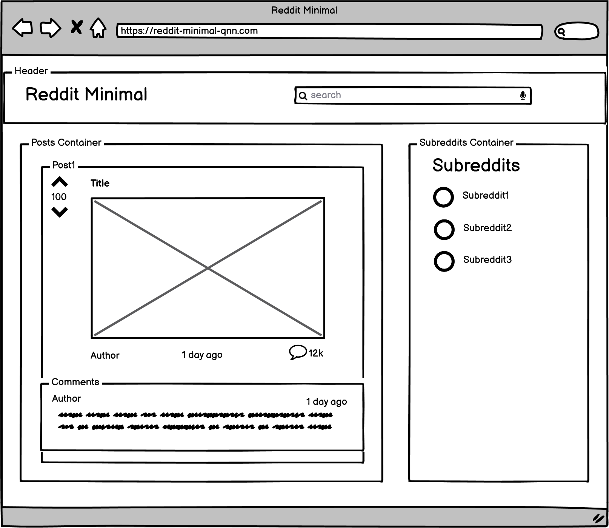

# React Redux Project: Reddit Minimal

Build an application for Reddit using React and Redux. This app will allow users to view and search posts and comments provided by Reddit API.

This project was bootstrapped with [Create React App](https://github.com/facebook/create-react-app).

## Available Scripts

In the project directory, you can run:
### `yarn install`

Installs all the dependencies in package.json file.

### `yarn start`

Runs the app in the development mode.\
Open [http://localhost:3000](http://localhost:3000) to view it in the browser.

The page will reload if you make edits.\
You will also see any lint errors in the console.

### `yarn test`

Launches the test runner in the interactive watch mode.\
See the section about [running tests](https://facebook.github.io/create-react-app/docs/running-tests) for more information.

### `yarn build`

Builds the app for production to the `build` folder.\
It correctly bundles React in production mode and optimizes the build for the best performance.

The build is minified and the filenames include the hashes.\
Your app is ready to be deployed!

See the section about [deployment](https://facebook.github.io/create-react-app/docs/deployment) for more information.

## Wireframes

## Features

### `posts`
Load posts from Reddit API and display it 
Load comments of a post and display it 
Users can click up-vote or down-vote for a post 

### `search`
Users can search posts using terms 

### `subreddits`
Load subreddits list and display it  
Users can choose a subreddit and view posts in that subreddit  

## Future work
- Add more unit tests and end-to-end tests
- Change CSS code for fancier style
- Use official API which require an OAuth workflow, not the undocumented JSON API, 